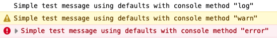
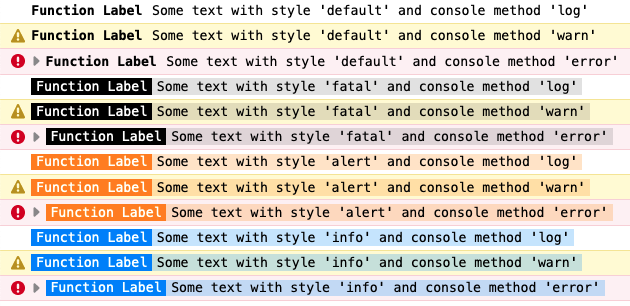

# logjs

## Package description
Enhanced logger for javascript. Able to colourise console outputs. Data arrays can be processed before outputting to console.

## How to use LogJS
### Simple usage

````javascript
import Logger from '@hveluwenkamp/logjs'

const example1 = Logger()

example1.p('Simple test message using defaults')
example1.type('log').p('Simple test message using defaults with console method "log"')
example1.type('warn').p('Simple test message using defaults with console method "warn"')
example1.type('error').p('Simple test message using defaults with console method "error"')
````



### Advanced usage
#### Styled console logs
Stepping through all the styles in Style object, with the console methods of log, warn, and error. This Style object can be customised by editing the CSS, and new styles can be added.
````javascript
import Logger, { Styles, Processors } from '@hveluwenkamp/logjs'

const example2 = Logger('Function Label', { styles: Styles, processors: Processors })

const styles = Object.keys(Styles)
const types = ['log', 'warn', 'error'] // useful console methods
styles.forEach(style => { // iterate over all styles in Style Object
    types.forEach(method => {
        example2.p(`Some text with style '${style}' and console method '${type}'`, { style, type })
    })
})
````



#### Array of data objects
Array data can be output using the console methods of log, dir, and table. 

This data can be processed using the functions in the Processors object. This object can be customised also.

The processing functions included are upper and lower case (**'upper'** and **'lower'**), splitting out parts of values to the left and right (**'left,&lt;symbol'>** and **'right,&lt;symbol'>**)of a given symbol, conversion to JSON (**'json'**)  date conversions using built-in javascript date methods (**'date,[toTimeString|toDateString|...]'**), and conversion of Unix timestamps to dates and date fragments (**'ux,[datetime|date|day|time|dow]'**).
````javascript
import Logger, { Styles, Processors } from '@hveluwenkamp/logjs'
import ExampleData from './example.data.js'

const example2 = Logger('Function Label', { styles: Styles, processors: Processors })

example2.set(ExampleData).out('table')

example2.set(ExampleData)
    .limit(4)
    .process({
        lastName: 'upper',
        unixTime: 'ux,datetime',
        safeEmail: 'left,@',
        timezone: 'right,/',
        iso8601: 'date,toLocaleTimeString'
    })
    .out('table')

example2.set(ExampleData)
  .limit(2)
  .include(['lastName', 'timezone'])
  .process({
    timezone: 'left,/'
  })
  .process({
    timezone: 'upper'
  })
  .out('table')
````


## Other examples
Refer to included example file.