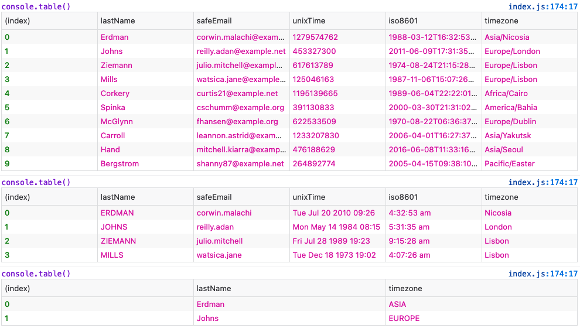

# logjs

## Package description
Enhanced logger for javascript. Able to colourise console oututs. Data arrays can be processed before outputting to console.

## Logger usage
### Simple logger usage

````javascript
import Logger from '@hveluwenkamp/logjs'

const test1 = Logger()

test1.p('Simple test message using defaults')
test1.type('warn').p('Simple test message using defaults with type "info"')
test1.type('error').p('Simple test message using defaults with type "error"')
````


### Advanced usage
#### Test all styles for all types including label.
````javascript
import Logger, { Styles, Processors } from '@hveluwenkamp/logjs'

const test2 = Logger('Function Label', { styles: Styles, processors: Processors })

const styles = Object.keys(Styles)
const types = ['log', 'warn', 'error'] // allowed console methods
styles.forEach(style => {
    types.forEach(type => {
        test2.p(`Some text with style '${style}' and type '${type}'`, { style, type })
    })
})
````


#### Display of array data with and without processing
````javascript
import Logger, { Styles, Processors } from '@hveluwenkamp/logjs'
import ExampleData from './example.data.js'

const test2 = Logger('Function Label', { styles: Styles, processors: Processors })

test2.set(ExampleData).out('table')

test2.set(ExampleData)
    .limit(4)
    .process({
        lastName: 'upper',
        unixTime: 'ux,datetime',
        safeEmail: 'left,@',
        timezone: 'right,/',
        iso8601: 'date,toLocaleTimeString'
    })
    .out('table')
````



